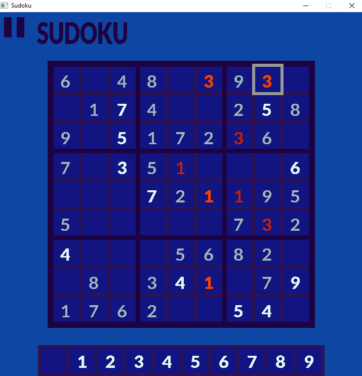

# Sudoku Game with SDL2 Project Documentation

## Introduction
This project allows users to play Sudoku at various difficulty levels. The application generates random boards using a simple backtracking algorithm and is built using Simple DirectMedia Layer 2 (SDL2) for the user interface.

## Requirements

The Sudoku game with SDL2 offers basic functionalities for gameplay. Users begin at the Main Menu, which includes options to 'Play' or 'Quit'. Upon selecting 'Play', users choose a difficulty level from easy, medium, or hard. The board generation time varies based on the selected difficulty, computer capabilities, and the randomness of the shuffled board. Typically, easy and medium difficulty boards generate almost instantly, while hard boards may take a few extra seconds to complete.

## Project Structure

This project is structured to develop a Sudoku game application using C++ and SDL (Simple DirectMedia Layer) for graphics rendering. Key components include:

* Main Modules:
  * Constants: Defines game constants such as colors, text, and positions.
  * Utilities: Provides utility functions for text rendering and other common tasks.
  * ViewType: Enumerates different views/screens of the game.

* Game Logic:
  * Square: Represents individual cells on the Sudoku board with value and type attributes.
  * Board: Manages the Sudoku board, including puzzle generation, solution validation, and user interactions.
  * Loading: Implements a loading screen with animated indicators while the game initializes.

* Graphics and Rendering:
  * SDL: Utilizes SDL library for graphics rendering and event handling.
  * SDL_ttf: Integrates SDL_ttf for rendering text on the screen.

* Concurrency:
  * Uses std::thread for concurrent board generation, ensuring smooth gameplay without blocking the main thread.

* Gameplay Flow:
  * Main Loop: Controls the flow of the game, transitioning between loading screens and gameplay views based on game state.
This project structure facilitates the development of a functional and interactive Sudoku game application in C++, leveraging SDL for graphical output and user interaction.

### Sudoku

The Sudoku class sets up the application and orchestrates the different parts of the game. It manages the main game loop, which includes event handling, screen refreshing, and framerate stabilization.

Key functionalities include:

* Initialization: The constructor initializes the Painter, MainMenu, Game, Loading, and Board objects, ensuring that all necessary resources and components are ready for the game to run.
* Main Game Loop: The mainLoop() method contains the primary loop that keeps the game running. It handles:
  * Event Handling: Uses SDL_PollEvent() to fetch events like keyboard presses, mouse clicks, and movement. If an SDL_QUIT event is detected, the loop exits.
  * View Management: Depending on the current view (MainMenu, Game, Loading), it delegates event handling to the appropriate module and updates the view accordingly.
  * Rendering: Calls the Painter::paint() method with the current view module to refresh the screen.
  * Framerate Stabilization: Measures the loop execution time and ensures a steady 60 FPS by introducing a delay if necessary.

The class ensures smooth transitions between different game states and maintains consistent performance, providing a cohesive and responsive user experience.

### Painter

The Painter class is responsible for setting up and managing the window, renderer, fonts, and textures for the game using SDL. It handles the initialization of the graphical environment and provides methods to render different game states.

Key functionalities include:

* Initialization: The constructor initializes the window, renderer, fonts, and textures, and sets a flag isSuccessfullyInitialized to indicate the success of the setup.
* Resource Management: Methods such as createWindow(), createRenderer(), loadFonts(), and loadTextures() are responsible for creating and loading the necessary SDL resources.
* Rendering: The paint(Paintable* paintable) method clears the screen, renders titles for different game states (main menu, game, loading), and calls the paint() method of the provided Paintable object to render its specific content.

The class ensures efficient management of SDL resources using smart pointers and proper cleanup in the destructor. It provides a foundation for rendering the game's visual components and handling graphical updates.

### Game

The Game class represents the main game logic and rendering for a board game using SDL for graphics. It extends the Paintable class and manages various elements such as number textures, fonts, and the game board itself.

Key functionalities include:

* Rendering: Methods like paint(), paintBoard(), paintNumbers(), and paintUI() handle the drawing of the game board, numbers, and UI elements.
* Event Handling: The runEvent() method processes user inputs, including keyboard and mouse events, to interact with the game, such as moving the selected square or placing numbers.
* Utilities: Helper methods like loadNumberTextures(), loadText(), and placeNumber() manage resources and game state changes.
* Game State: The class tracks the selected square on the board and whether the game is won or paused.

The class is constructed with SDL renderer and font pointers, ensuring it can draw and manage game elements efficiently.

### MainMenu

The MainMenu class manages the main menu of the Sudoku game. It inherits from the Paintable class and uses SDL2 for rendering and event handling.

Key Functionalities:

* Initialization: Sets up textures for menu options (Play, Quit, difficulty levels) and checks for successful initialization.
* Menu States and Options:
  * MenuState: Represents the current state (MAIN_SCREEN, DIFFICULTY_LEVEL_SELECTION, PAUSE_MENU).
  * MenuOption: Represents the selected option (NONE, PLAY, QUIT, EASY, MEDIUM, HARD).
* Rendering: The paint() method renders the menu based on the current state and selected option.
* Event Handling: The runEvent() method processes SDL events to handle mouse movements and clicks.
* Mouse Position Handling: setMousePosition() updates the selected option based on the mouse position.
* Click Handling: The click() method updates the state or selected difficulty level based on the selected option.
* Text Loading: loadTexts() generates textures for menu text options.

This class provides the functionality to navigate the main menu, select difficulty levels, and start the game.

### Loading

The Loading class handles the loading screen of the Sudoku game, displaying a loading message and an indicator while the game board is being generated. It inherits from the Paintable class and utilizes SDL2 for rendering and text generation.

Key Functionalities:

* Initialization and Cleanup:

  * The constructor initializes textures for the loading text and indicator, and accepts shared pointers to SDL_Renderer, TTF_Font, and Board.
  * The destructor ensures proper cleanup of resources.
* Text Loading:

  * loadTexts(): Generates textures for the loading text and indicator using Utilities::generateTextTexture(). Returns true if successful, false otherwise.

* Loading Status Check:

  * checkLoading(): Checks if the board generation has ended by calling pBoard->hasBoardGenerationEnded().
  * Updates the loading indicator status every 500 milliseconds.
  * Returns ViewType::GAME if the board is ready, otherwise ViewType::LOADING.
* Rendering:
    * paint(): Renders the loading text and indicator on the screen. The indicator's position is updated based on indicatorStatus.

### Board

The Board class manages a Sudoku game board, handling puzzle generation, solution validation, and user interactions. Key functionalities include:

* Board Initialization: Represents a 9x9 grid of Square objects to store numbers and their types (user-input, program-generated).
* Puzzle Generation: Utilizes backtracking algorithms and randomization to create Sudoku puzzles of varying difficulties (easy, medium, hard).
* Puzzle Solving: Implements methods (solveBoardRandom() and solveBoardFast()) to recursively solve Sudoku puzzles.
* Validation and Error Handling: Checks for rule violations (duplicate numbers in rows, columns, or 3x3 grids) and marks user-input errors.
* Game State Management: Tracks board completion (isGameWon()), manages puzzle complexity levels, and ensures puzzle generation completion (hasBoardGenerationEnded()).
* Concurrency: Uses std::thread for asynchronous board generation, allowing background puzzle creation while the game interface remains responsive.

This class forms the backbone of Sudoku gameplay mechanics, ensuring puzzle generation, solving, and validation align with the game's rules and user interactions.

## Capabilities

Application Capabilities Overview
This Sudoku game application developed in C++ and SDL offers the following capabilities:

* Interactive Gameplay: Users can solve Sudoku puzzles through intuitive mouse and keyboard interactions.

* Multiple Difficulty Levels: Supports easy, medium, and hard difficulty levels with dynamically generated puzzles.

* Real-time Feedback: Provides immediate feedback on user-entered numbers, highlighting errors in red.

* Visual Clarity: Utilizes SDL for clear, visually appealing graphics and text rendering on the game board.

* Loading Screen: Displays a loading screen with animated indicators while puzzles are generated in the background.

* Concurrency: Implements multi-threading to ensure responsive gameplay and smooth transitions between screens.

* Validation: Verifies the correctness of user solutions and alerts users to incorrect placements.

* User-Friendly Interface: Features an intuitive interface with clear instructions and visual cues to aid gameplay.

* Customizable Settings: Allows users to adjust settings such as sound, colors, and display preferences.

This application aims to provide an engaging Sudoku-solving experience with robust functionalities and a polished user interface, enhancing user satisfaction and enjoyment.

## Main Development Problem

The main challenge was developing the board generation process for Sudoku. The primary strategy involved initially creating a full board randomly and then progressively removing numbers one by one, ensuring each step maintained a unique solution. However, the basic backtracking algorithm I implemented proved insufficient for generating very difficult boards with fewer than 30 numbers remaining.

This method is highly randomized due to the random order of number removal. Consequently, while some hard boards can be generated in seconds, others may take significantly longer. To address this, I explored a more effective algorithm for solving Sudoku boards called Algorithm X, developed by Donald Knuth. This algorithm doesn't directly solve Sudoku but rather finds solutions to the exact cover problem. Sudoku puzzles can be translated into this problem format, requiring a "dancing links" matrix with 324 columns and 729 rows of boolean values interconnected in specific patterns. However, implementing this method posed challenges, especially regarding debugging, due to its complexity.

To mitigate long board generation times, I implemented a secondary std::thread to handle puzzle generation separately, preventing application freezing. This thread continually updates the best-found board whenever a better solution is discovered. If the solution meets certain criteria, the main thread terminates the board generation process. Terminating this recursive function smoothly is tricky but currently functions without disrupting the player experience.

Overall, while developing robust board generation remains challenging, the current approach effectively balances speed and complexity to provide a satisfactory Sudoku-solving experience.

## Conclusion

Despite initial expectations, I am pleased with the outcome of this project. Along the way, I gained valuable insights into SDL2, C++, and the intricacies of Sudoku itself. A notable learning experience was integrating smart pointers into my project for the first time. I discovered their efficiency in memory management compared to traditional 'new' and 'delete' methods, offering simpler solutions and alleviating concerns about memory release. This approach also seamlessly integrates with SDL2, where dynamic memory allocation plays a crucial role in handling various aspects of the application.